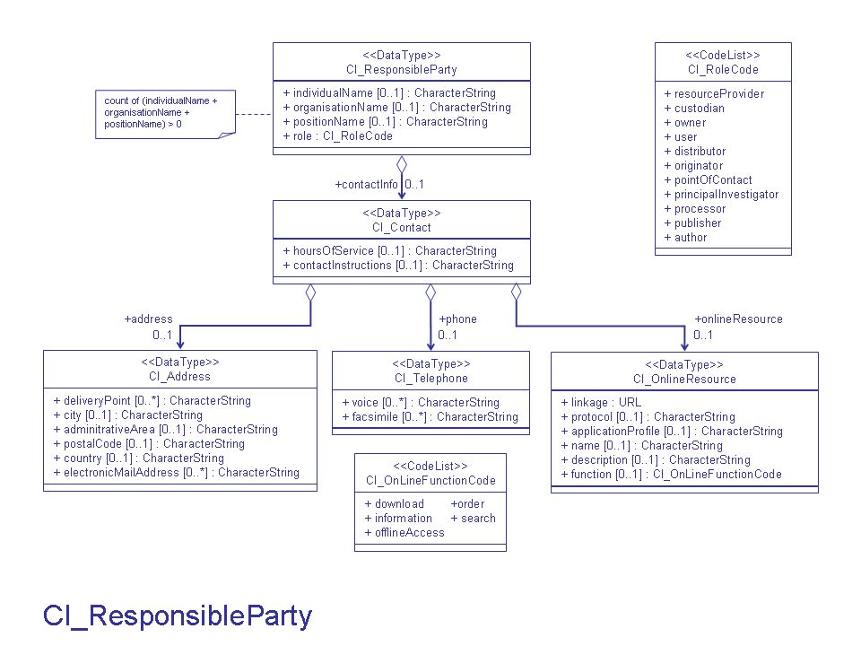

| #   | Elements                                                                      | Usage | Definition and Recommended Practice                                                                                                                                                                             |
|-----|-------------------------------------------------------------------------------|-------|-----------------------------------------------------------------------------------------------------------------------------------------------------------------------------------------------------------------|
| 1   | [individualName](/iso-explorer/CharacterString)                               | 0...1 | Name of the person. Must provide at least one of the following: individualName, organisationName, or positionName.                                                                                              |
| 2   | [organisationName](/iso-explorer/CharacterString)                             | 0...1 | Name of the organization. Highly recommend using the first part of the keyword from NASA GCMD Data Centers list. Must provide at least one of the following: individualName, organisationName, or positionName. |
| 3   | [positionName](/iso-explorer/CharacterString)                                 | 0...1 | Position of the responsible party. Recommend using if person's name is not documented. Must provide at least one of the following: individualName, organisationName, or positionName.                           |
| 4   | [contactInfo](/iso-explorer/CharacterString)                                  | 0...* | Information required enabling contact with the responsible person and/or organisation or a URL to a cited document.                                                                                             |
| 5   | [role](/iso-explorer/ISO_19115_and_19115-2_CodeList_Dictionaries#CI_RoleCode) | 1     | Function performed by the responsible party. See list of definitions for best practices.                                                                                                                        |

### Community Requirements

*M = Mandatory; C = Conditional; R = Recommended; blank cell = user discretion*
# NOAA Rubric
| Community                   | Element          | M/C/R | Notes                                   |
|-----------------------------|------------------|-------|-----------------------------------------|
| NOAA Completeness Rubric V2 | individualName   | C     | Include at least one of these elements. |
| NOAA Completeness Rubric V2 | organisationName | C     | Include at least one of these elements. |
| NOAA Completeness Rubric V2 | positionName     | C     | Include at least one of these elements. |
| NOAA Completeness Rubric V2 | contactInfo      |       | Same requirements as the ISO standard.  | 
| NOAA Completeness Rubric V2 | role             | M     | Same requirements as the ISO standard.  |

# OneStop Project
| Community                   | Element          | M/C/R | Notes                                   |
|-----------------------------|------------------|-------|-----------------------------------------|
| OneStop Project             | individualName   | C     | Include at least one of these elements. |
| OneStop Project             | organisationName | C     | Include at least one of these elements. |
| OneStop Project             | positionName     | C     | Include at least one of these elements. |
| OneStop Project             | contactInfo      |       | Same requirements as the ISO standard.  | 
| OneStop Project             | role             | M     | Same requirements as the ISO standard.  |                 

### More Information

**UML**

[//]: # (**Links**)

[//]: # ()
[//]: # (-   [ISO People]&#40;/ISO_People "wikilink"&#41;)

[//]: # (-   [ISO_Researcher_ID]&#40;/ISO_Researcher_ID "wikilink"&#41;)
