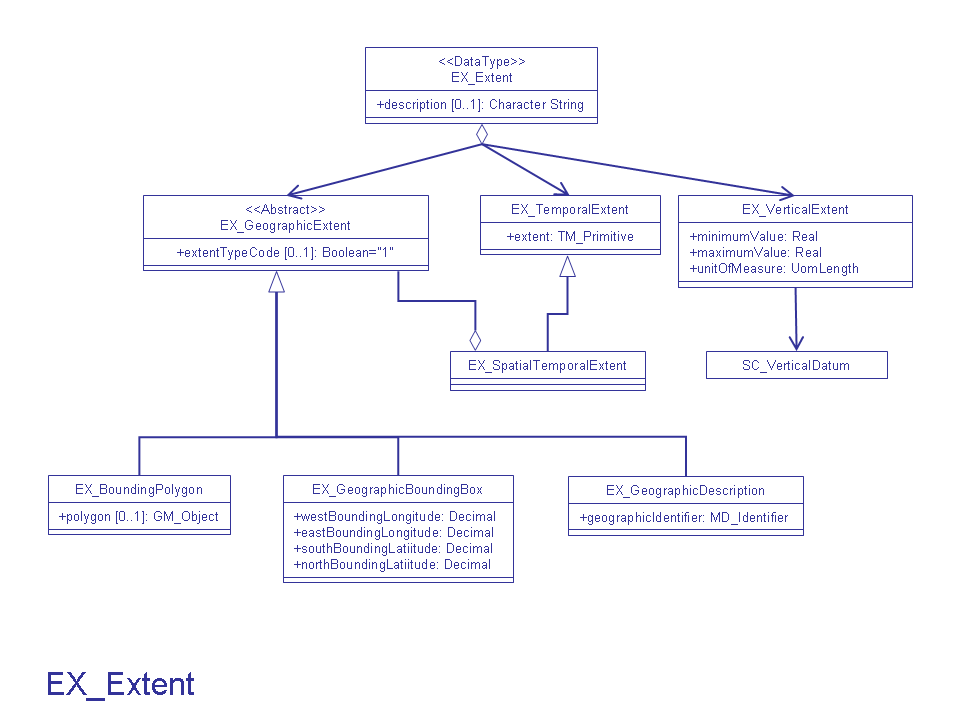

# EX_BoundingPolygon

| #   | Elements                                | Usage | Definition and Recommended Practice |
|-----|-----------------------------------------|-------|-------------------------------------|
| 1   | [extentTypeCode](/iso-explorer/Boolean) | 1     |                                     |
| 2   | [polygon](/iso-explorer/GM_Object)      | 0...1 |                                     |

### More Information

### UML(Unified Modeling Language) Image

[//]: # (**Links**)
[//]: # ( todo add missing links and pages)
[//]: # ()
[//]: # (-   [ISO Extents]&#40;/ISO_Extents "wikilink"&#41;)

[//]: # (-   [GML Guidance for ISO Metadata]&#40;/GML_Guidance_for_ISO_Metadata "wikilink"&#41;)