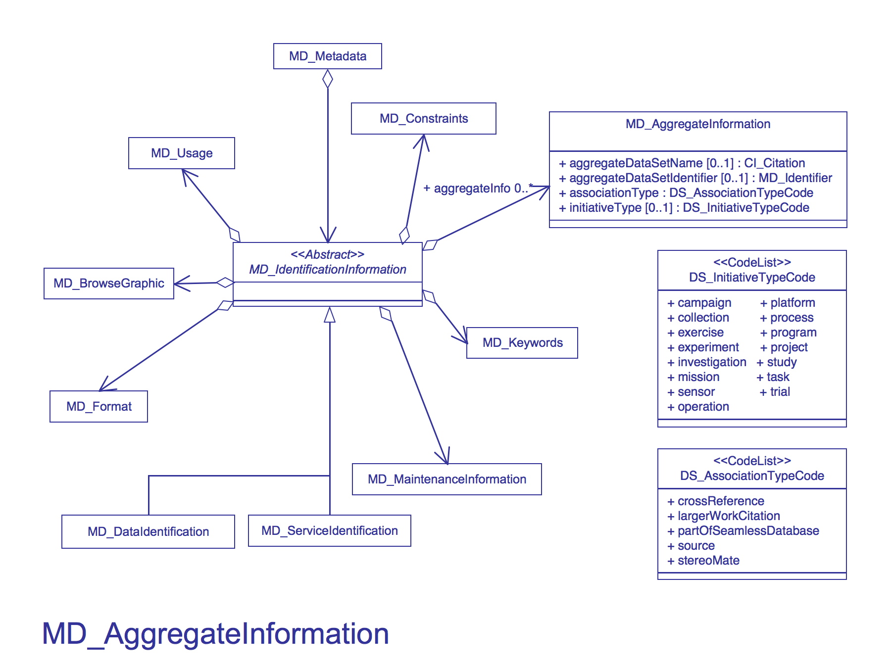

# MD_AggregateInformation

It is highly recommended that you use this section to provide citations and identifiers to associated resources, such as papers, user guides, programs and larger works.

| #   | Elements                                                                     | Usage | Definition and Recommended Practice                                                                                                                                                                                                                                                              |
|-----|------------------------------------------------------------------------------|-------|--------------------------------------------------------------------------------------------------------------------------------------------------------------------------------------------------------------------------------------------------------------------------------------------------|
| 1   | [aggregateDataSetName](/iso-explorer/CI_Citation)                            | 0...1 | The citation to the associated resource.                                                                                                                                                                                                                                                         |
| 2   | [aggregateDataSetIdentifier](/iso-explorer/MD_Identifier)                    | 0...1 | The identifer to the associated resource. Don't use. Deprecated in ISO 19115-1.                                                                                                                                                                                                                  |
| 3   | [associationType](/iso-explorer/ISO_19115_and_19115-2_CodeList_Dictionaries) | 1     | Use the 'crossReference' code value to identify related datasets or documents, such as science papers, user guides, or specification documents. Use 'largerWorkCitation' code value to identify a master dataset, larger program or operation of which this resource is a part.                  |
| 4   | [initiativeType](/iso-explorer/ISO_19115_and_19115-2_CodeList_Dictionaries   | 0...1 | Use of the following extended code values: 'userGuide', 'sciencePaper', or 'dataDictionary' to categorize documents in 'crossReference'. Use the following code values: 'campaign', 'collection', 'mission', 'operation', 'project' or 'program' to categorize the type of 'largerWorkCitation'. |

### Community Requirements

*M = Mandatory; C = Conditional; R = Recommended; blank cell = user discretion*

# NOAA Rubric
| Community                   | Element              | M/C/R | Notes                                  |
|-----------------------------|----------------------|-------|----------------------------------------|
| NOAA Completeness Rubric V2 | aggregateDataSetName | R     | Extra credit for recommended fields.   |
| NOAA Completeness Rubric V2 | associationType      | R     | Extra credit for recommended fields.   |
| NOAA Completeness Rubric V2 | initiativeType       | R     | Extra credit for recommended fields.   |
|                             |                      |       |                                        |
| OneStop Project             | aggregateDataSetName |       | Same requirements as the ISO standard. |
| OneStop Project             | associationType      | M     | Same requirements as the ISO standard. |
| OneStop Project             | initiativeType       |       | Same requirements as the ISO standard. |

### More Information

#### UML(Unified Modeling Language) Image

### Links
-   [ISO_AggregationInformation](/ISO_AggregationInformation "wikilink")
