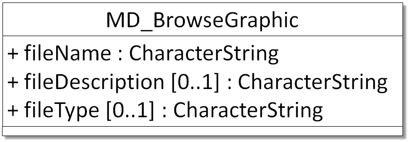

# MD_BrowseGraphic

It is highly recommended that you use this section to provide citations and identifiers to associated resources, such as papers, user guides, programs and larger works.

| #   | Elements                                         | Usage | Definition and Recommended Practice                                                                                                                                                                                                                                                                                                                                                                                                                                          |
|-----|--------------------------------------------------|-------|------------------------------------------------------------------------------------------------------------------------------------------------------------------------------------------------------------------------------------------------------------------------------------------------------------------------------------------------------------------------------------------------------------------------------------------------------------------------------|
| 1   | [fileName](/iso-explorer/CharacterString)        | 1     | URL to a thumbnail image that can be rendered in browser. In order of importance, we recommend these types of images:   1. sample imagery produced by data.   2. map/location representing of data location   3. snapshot of a time series plot  4. an image of the station or lab  5. or as a last resort, a logo associated with data (e.g. project logo).   *(NOTE: This is the ONLY gco:CharacterString field that SHOULD contain a URL.)* |
| 2   | [fileDescription](/iso-explorer/CharacterString) | 0...1 | Brief sentence that can become an image caption.                                                                                                                                                                                                                                                                                                                                                                                                                             |
| 3   | [fileType](/iso-explorer/CharacterString)        | 0...1 | Suffix of image type.                                                                                                                                                                                                                                                                                                                                                                                                                                                        |

# NOAA Rubric
| Community                   | Element         | M/C/R | Notes                                  |
|-----------------------------|-----------------|-------|----------------------------------------|
| NOAA Completeness Rubric V2 | fileName        | R     | Same requirements as the ISO standard. |
| NOAA Completeness Rubric V2 | fileDescription |       | Same requirements as the ISO standard. |
| NOAA Completeness Rubric V2 | fileType        |       | Same requirements as the ISO standard. |
|                             |                 |       |                                        |
| OneStop Project             | fileName        | M     | Same requirements as the ISO standard. |
| OneStop Project             | fileDescription |       | Same requirements as the ISO standard. |
| OneStop Project             | fileType        |       | Same requirements as the ISO standard. |

### Community Requirements

*M = Mandatory; C = Conditional; R = Recommended; blank cell = user discretion*

### More Information

#### UML(Unified Modeling Language) Image

Examples:

    graphicOverview:  (MD_BrowseGraphic)
    fileName: https://www.ngdc.noaa.gov/mgg/ocean_age/data/2008/image/age_oceanic_lith.jpg
    fileDescription:  crustal ages
    fileType:  JPEG

