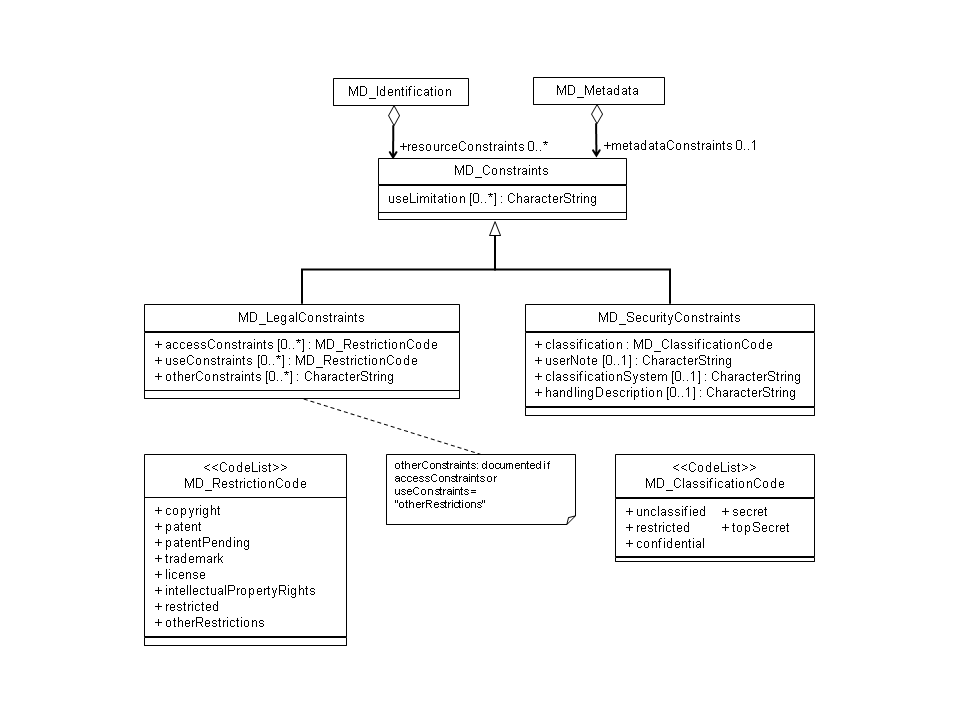

# MD_Constraints

#### Comprehensive explorer of ISO 19115 and 19115-2 metadata standards. These pages show the correct order of the elements, links to child element/object, obligation, repeatability and references to more information and examples.

_Usage: 1 = Mandatory, 0...1 = Optional, 0...* = Optional, can occur more than once_

### Choose only 1 from the table below

| # | Element                                                        | Usage | Definition and Recommended Practice                                                                                                                                    |
|---|----------------------------------------------------------------|-------|------------------------------------------------------------------------------------------------------------------------------------------------------------------------|
| 1 | [useLimitation](/iso-explorer/CharacterString)                 | 0..\* | *Limitation affecting the fitness for use of the resource or metadata.*                                                                                                |
| 1 | [MD_LegalConstraints](/iso-explorer/MD_LegalConstraints)       | 0..\* | *Constraints applied to assure the protection of privacy or intellectual property, and any special restrictions or limitations on obtaining the resource or metadata.* |
| 1 | [MD_SecurityConstraints](/iso-explorer/MD_SecurityConstraints) | 0..\* | *Handling restrictions imposed on the resource or metadata for national security or similar security concerns.*                                                        |

### Community Requirements

*M = Mandatory; C = Conditional; R = Recommended; blank cell = user discretion*

# NOAA Rubric
| Community                   | Element                | M/C/R | Notes |
|-----------------------------|------------------------|-------|-------|
| NOAA Completeness Rubric V2 | useLimitation          |       |       |
| NOAA Completeness Rubric V2 | MD_LegalConstraints    |       |       |
| NOAA Completeness Rubric V2 | MD_SecurityConstraints |       |       |

# OneStop Project
| Community       | Element                    | M/C/R | Notes |
|-----------------|----------------------------|-------|-------|
| OneStop Project | useLimitation              |       |       |
| OneStop Project | MD_LegalConstraints        |       |       |
| OneStop Project | MD_SecurityConstraints     |       |       |

### More Information

##### UML

[//]: # (<table class="wikitable">)

[//]: # (<tr>)

[//]: # (<th>)

[//]: # (UML)

[//]: # ()
[//]: # (</th>)

[//]: # (<td bgcolor="FFFFFF">)

[//]: # ([thumb|left|MD Constraint.png]&#40;/Image:MD_Constraint.png "wikilink"&#41;)

[//]: # ()
[//]: # (</td>)

[//]: # (<tr>)

[//]: # (<th>)

[//]: # (Links)

[//]: # ()
[//]: # (</th>)

[//]: # (<td bgcolor="FFFFFF">)

[//]: # (-   [ISO Constraints]&#40;/ISO_Constraints "wikilink"&#41;)

[//]: # ()
[//]: # (</td>)

[//]: # (</tr>)

[//]: # (</table>)
