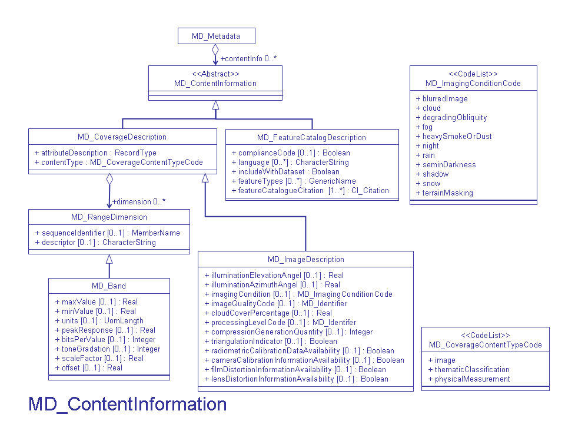

# MD_ContentInformation

#### MD_ContentInformation is abstract. MI_CoverageDescription, MD_FeatureCatalogueDescription, or MI_ImageDescription will replace it in the XML representation.

choose one:

- [MI_CoverageDescription](/iso-explorer/MI_CoverageDescription)
- [MD_FeatureCatalogDescription](/iso-explorer/MD_FeatureCatalogDescription)
- [MI_ImageDescription](/iso-explorer/MI_ImageDescription)

### Community Requirements
M = Mandatory; C = Conditional; R = Recommended; blank cell = user discretion

# NOAA Rubric
| Community                   | Element                      | M/C/R | Notes                                                                      |
|-----------------------------|------------------------------|-------|----------------------------------------------------------------------------|
| NOAA Completeness Rubric V2 | MI_CoverageDescription       | C     | Must include either MI_CoverageDescription MD FeatureCatalogueDescription. |
| NOAA Completeness Rubric V2 | MD_FeatureCatalogDescription | C     | Must include either MI_CoverageDescription MD FeatureCatalogueDescription. |
| NOAA Completeness Rubric V2 | MI_ImageDescription          |       |                                                                            |

# OneStop Project
| Community        | Element                      | M/C/R | Notes                                                                      |
|------------------|------------------------------|-------|----------------------------------------------------------------------------|
| OneStop Project  | MI_CoverageDescription       | C     | Must include either MI_CoverageDescription MD FeatureCatalogueDescription. |
| OneStop Project  | MD_FeatureCatalogDescription | C     | Must include either MI_CoverageDescription MD FeatureCatalogueDescription. |
| OneStop Project  | MI_ImageDescription          |       |                                                                            |

### More Information

##### UML

