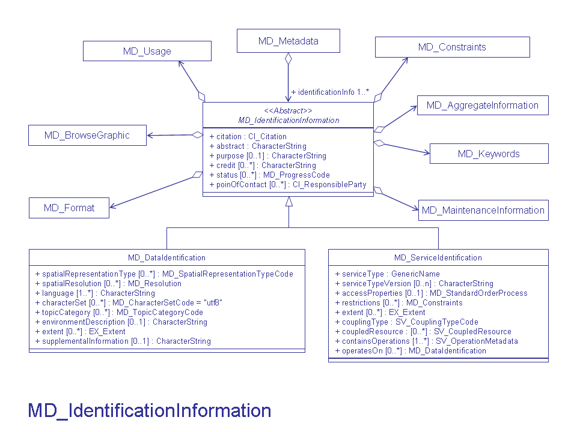

# MD_DataIdentification

#### Comprehensive explorer of ISO 19115 and 19115-2 metadata standards. These pages show the correct order of the elements, links to child element/object, obligation, repeatability and references to more information and examples.

_Usage: 1 = Mandatory, 0...1 = Optional, 0...* = Optional, can occur more than once_

| #   | Element                                                                                                                | Usage | Definition and Recommended Practice                                                                                                                                                                                                                                                                                                                                                                                                                                                                                                                                                                                                                                                                                                                                |
|-----|------------------------------------------------------------------------------------------------------------------------|-------|--------------------------------------------------------------------------------------------------------------------------------------------------------------------------------------------------------------------------------------------------------------------------------------------------------------------------------------------------------------------------------------------------------------------------------------------------------------------------------------------------------------------------------------------------------------------------------------------------------------------------------------------------------------------------------------------------------------------------------------------------------------------|
| 1   | [citation](/iso-explorer/CI_Citation)                                                                                  | 1     | Citation for the resource, includes name, publication date, identifiers, originators and publishers.                                                                                                                                                                                                                                                                                                                                                                                                                                                                                                                                                                                                                                                               |
| 2   | [abstract](/iso-explorer/CharacterString)                                                                              | 1     | Brief narrative summary of the resource. This is different than a scientific abstract. Limit information in the abstract to the specific resource that is being described. Provide descriptive information in a clear, concise and human readable manner. Describe the contents of the resource and the key aspects and/or attributes that are represented. Briefly explain what is unique about this resource and, if appropriate how it differs from similar resources. Ensure contextual information important to the use of the resource are explained, e.g. formats, recommended tools, related resources, or limitations. Avoid citing external sources to this resource. See [Abstract Other Recommendations](/iso-explorer/Abstract_Other_Recommendations) |
| 3   | [purpose](/iso-explorer/CharacterString)                                                                               | 0...1 | Summary of intentions for which the resource was developed. See [Purpose_Example](/iso-explorer/Purpose_Example)                                                                                                                                                                                                                                                                                                                                                                                                                                                                                                                                                                                                                                                   |
| 4   | [credit](/iso-explorer/CharacterString)                                                                                | 0...* | Recognition of those who contributed to the dataset. Do not include URLs here. Provide full citations in [MD_AggregateInformation](/iso-explorer/MD_AggregateInformation) section.                                                                                                                                                                                                                                                                                                                                                                                                                                                                                                                                                                                 |
| 5   | [status](/iso-explorer/ISO_19115_and_19115-2_CodeList_Dictionaries#MD_ProgressCode)                                    | 0...* | Status of resource development. Most common status values to use are 'completed', 'ongoing', 'planned' or 'underDevelopment'. Highly recommend populating this field. See [Status_Example](/iso-explorer/Status_Example)                                                                                                                                                                                                                                                                                                                                                                                                                                                                                                                                           |
| 6   | [pointOfContact](/iso-explorer/CI_ResponsibleParty)                                                                    | 0...* | Individuals and/or organizations available for questions about the resource. Use roleCode=“pointOfContact”. This should be a person at an archive or the originator of the resource. Provide contact details, such address, phone and email.                                                                                                                                                                                                                                                                                                                                                                                                                                                                                                                       |
| 7   | [resourceMaintenance](/iso-explorer/MD_MaintenanceInformation)                                                         | 0...* | Information about the frequency, scope, and responsible party for the updating of the resource. See [MD_MaintenanceInformation Examples](/iso-explorer/MD_MaintenanceInformation_Examples)                                                                                                                                                                                                                                                                                                                                                                                                                                                                                                                                                                         |
| 8   | [graphicOverview](/iso-explorer/MD_BrowseGraphic)                                                                      | 0...* | A small image that exemplifies the collective resource. The graphic file should be less than 500KB and 1000x1000 pixels. Provide URL to an image that can be rendered in browsers.                                                                                                                                                                                                                                                                                                                                                                                                                                                                                                                                                                                 |
| 9   | [resourceFormat](/iso-explorer/MD_Format)                                                                              | 0...* | Information about the formats of the resource. This is independant of the distribution details and is useful to provide when the resource has a status of 'planned' or 'underDevelopment'.                                                                                                                                                                                                                                                                                                                                                                                                                                                                                                                                                                         |
| 10  | [descriptiveKeywords](/iso-explorer/MD_Keywords)                                                                       | 0...* | Commonly used words or phrases which describe the dataset. Optionally, the keyword type and a citation for the authoritative or registered resource of the keywords are also provided.                                                                                                                                                                                                                                                                                                                                                                                                                                                                                                                                                                             |
| 11  | [resourceSpecificUsage](/iso-explorer/MD_Usage)                                                                        | 0...* | Basic information about specific application(s) for which the resource(s) has been or is being used by different users.                                                                                                                                                                                                                                                                                                                                                                                                                                                                                                                                                                                                                                            |
| 12  | [resourceConstraints](/iso-explorer/MD_Constraints)                                                                    | 0...* | The limitations or constraints on the use of or access to the resource.                                                                                                                                                                                                                                                                                                                                                                                                                                                                                                                                                                                                                                                                                            |
| 13  | [aggregationInfo](/iso-explorer/MD_AggregateInformation)                                                               | 0...* | The citations and identifiers of associated resources, such as projects and documents.                                                                                                                                                                                                                                                                                                                                                                                                                                                                                                                                                                                                                                                                             |
| 14  | [spatialRepresentationType](/iso-explorer/SO_19115_and_19115-2_CodeList_Dictionaries#MD_SpatialRepresentationTypeCode) | 0...* | Object(s) used to represent the geographic information.                                                                                                                                                                                                                                                                                                                                                                                                                                                                                                                                                                                                                                                                                                            |
| 15  | [spatialResolution](/iso-explorer/CharacterString)                                                                     | 0...* | The level of detail of the dataset expressed as equivalent scale or ground distance.                                                                                                                                                                                                                                                                                                                                                                                                                                                                                                                                                                                                                                                                               |
| 16  | [language](/iso-explorer/CharacterString)                                                                              | 1...* | Languages of the dataset using standard ISO three-letter codes. Best Practice: `eng; USA`                                                                                                                                                                                                                                                                                                                                                                                                                                                                                                                                                                                                                                                                          |
| 17  | [characterSet](/iso-explorer/CharacterString)                                                                          | 0...* | Character coding standard in the dataset.                                                                                                                                                                                                                                                                                                                                                                                                                                                                                                                                                                                                                                                                                                                          |
| 18  | [topicCategory](/iso-explorer/CharacterString)                                                                         | 0...* | High-level thematic classifications to assist in the grouping and searching of data. Required when the hierarchyLevelName scopeCode is 'dataset'. Recommended when hierarchyLevelName scopeCode is 'series', 'fieldSession', or 'nonGeographicDataset'. The most applicable topics in NOAA are usually geoscientificInformation, climatologyMeteorologyAtmosphere, oceans or elevation. Repeat if more than one category is applicable. Keep the capitalization and spacing of the terms.                                                                                                                                                                                                                                                                          |
| 19  | [environmentDescription](/iso-explorer/CharacterString)                                                                | 0...1 | Describes the dataset’s processing environment. Includes information, such as software, computer operating system, filename, and dataset size. Provide full citations in the [LI_Lineage](/LI_Lineage "wikilink") section.                                                                                                                                                                                                                                                                                                                                                                                                                                                                                                                                         |
| 20  | [extent](/iso-explorer/CharacterString)                                                                                | 0...* | Information about the spatial, horizontal and/or vertical, and the temporal coverage of the resource.                                                                                                                                                                                                                                                                                                                                                                                                                                                                                                                                                                                                                                                              |
| 21  | [supplementalInformation](/iso-explorer/CharacterString)                                                               | 0...1 | Other descriptive information about the resource.                                                                                                                                                                                                                                                                                                                                                                                                                                                                                                                                                                                                                                                                                                                  |

### Community Requirements

*M = Mandatory; C = Conditional; R = Recommended; blank cell = user discretion*

# NOAA Rubric
| Community                   | Element                   | M/C/R | Notes                                 |
|-----------------------------|---------------------------|-------|---------------------------------------|
| NOAA Completeness Rubric V2 | citation                  | M     |                                       |
| NOAA Completeness Rubric V2 | abstract                  | M     |                                       |
| NOAA Completeness Rubric V2 | purpose                   | M     |                                       |
| NOAA Completeness Rubric V2 | credit                    |       | Same requirements as the ISO standard |
| NOAA Completeness Rubric V2 | status                    | M     |                                       |
| NOAA Completeness Rubric V2 | pointOfContact            | M     |                                       |
| NOAA Completeness Rubric V2 | resourceMaintenance       | R     | Extra credit for recommended fields   |
| NOAA Completeness Rubric V2 | graphicOverview           | R     | Extra credit for recommended fields   |
| NOAA Completeness Rubric V2 | resourceFormat            |       | Same requirements as the ISO standard |
| NOAA Completeness Rubric V2 | descriptiveKeywords       | M     |                                       |
| NOAA Completeness Rubric V2 | resourceSpecificUsage     |       | Same requirements as the ISO standard |
| NOAA Completeness Rubric V2 | resourceConstraints       | M     |                                       |
| NOAA Completeness Rubric V2 | aggregationInfo           | R     | Extra credit for recommended fields   |
| NOAA Completeness Rubric V2 | spatialRepresentationType | M     |                                       |
| NOAA Completeness Rubric V2 | spatialResolution         |       | Same requirements as the ISO standard |
| NOAA Completeness Rubric V2 | language                  |       |                                       |
| NOAA Completeness Rubric V2 | characterSet              |       |                                       |
| NOAA Completeness Rubric V2 | topicCategory             | M     |                                       |
| NOAA Completeness Rubric V2 | environmentDescription    |       | Same requirements as the ISO standard |
| NOAA Completeness Rubric V2 | extent                    | M     | Only geographicExtent is conditional  |
| NOAA Completeness Rubric V2 | supplementalInformation   |       | Same requirements as the ISO standard |

# OneStop Project
| Community       | Element                   | M/C/R | Notes                                 |
|-----------------|---------------------------|-------|---------------------------------------|
| OneStop Project | citation                  | M     |                                       |
| OneStop Project | abstract                  | M     |                                       |
| OneStop Project | purpose                   | M     |                                       |
| OneStop Project | credit                    |       | Same requirements as the ISO standard |
| OneStop Project | status                    | M     |                                       |
| OneStop Project | pointOfContact            | M     |                                       |
| OneStop Project | resourceMaintenance       |       | Extra credit for recommended fields   |
| OneStop Project | graphicOverview           | M     | Extra credit for recommended fields   |
| OneStop Project | resourceFormat            |       | Same requirements as the ISO standard |
| OneStop Project | descriptiveKeywords       | M     |                                       |
| OneStop Project | resourceSpecificUsage     |       | Same requirements as the ISO standard |
| OneStop Project | resourceConstraints       | M     |                                       |
| OneStop Project | aggregationInfo           | R     | Extra credit for recommended fields   |
| OneStop Project | spatialRepresentationType | M     |                                       |
| OneStop Project | spatialResolution         |       | Same requirements as the ISO standard |
| OneStop Project | language                  |       |                                       |
| OneStop Project | characterSet              |       |                                       |
| OneStop Project | topicCategory             | M     |                                       |
| OneStop Project | environmentDescription    |       | Same requirements as the ISO standard |
| OneStop Project | extent                    | M     | Only geographicExtent is conditional  |
| OneStop Project | supplementalInformation   |       | Same requirements as the ISO standard |

### More Information

#### UML(Unified Modeling Language) Image

[//]: # (### Links)

[//]: # (-   [Documentation Spirals\#Identification]&#40;/Documentation_Spirals#Identification "wikilink"&#41;)
