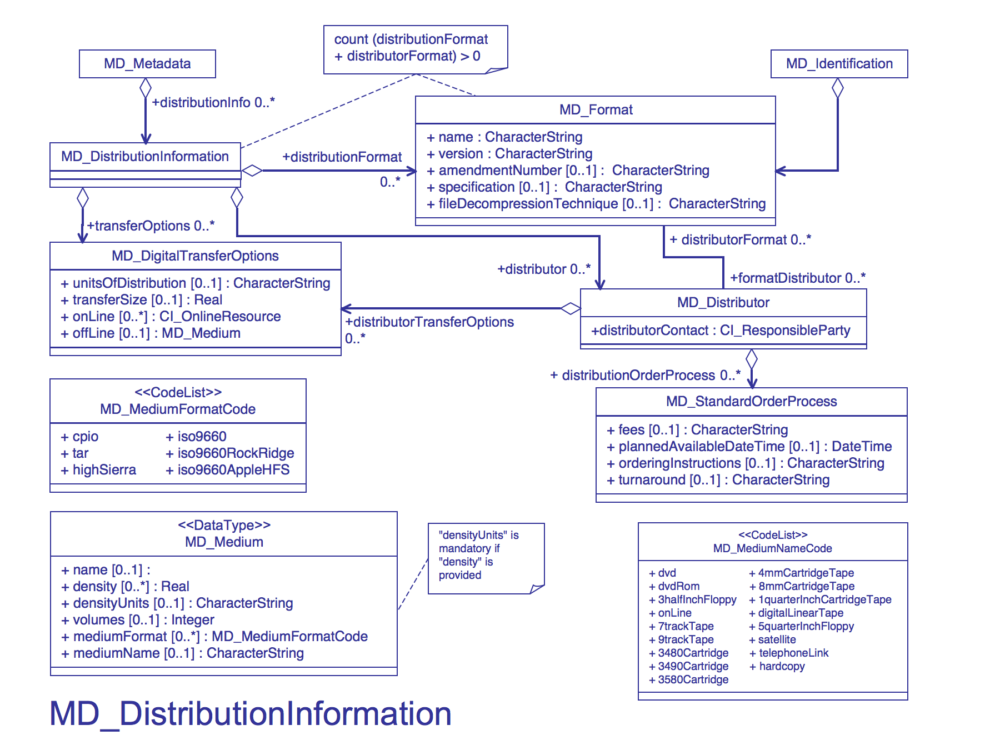

# MD_AggregateInformation

It is highly recommended that you use this section to provide citations and identifiers to associated resources, such as papers, user guides, programs and larger works.

| # | Elements                                                    | Usage | Definition and Recommended Practice                                                                                                                                                                                                                                                           |
|---|-------------------------------------------------------------|-------|-----------------------------------------------------------------------------------------------------------------------------------------------------------------------------------------------------------------------------------------------------------------------------------------------|
| 1 | [name](/iso-explorer/CharacterString)                       | 1     | Name of the resource format. Examples formats:  `ASCII` `NetCDF` `HDF5`                                                                                                                                                                                                                       |
| 2 | [version](/iso-explorer/CharacterString)                    | 1     | Version of the format. Use gco:nilReason attribute if version is unknown. `4` `<gmd:version gco:nilReason="inapplicable" />`                                                                                                                                                                  |
| 3 | [amendmentNumber](/iso-explorer/CharacterString)            | 0...1 | Amendment number of the format version.                                                                                                                                                                                                                                                       |
| 4 | [specification](/iso-explorer/CharacterString)              | 0...1 | Name of a subset, profile, or product specification of the format. Identify the name of the specification. Do not include URL to specification. Provide full citation in the [MD_AggregateInformation](/MD_AggregateInformation "wikilink") section. **Example**:`NCEI NetCDF Templates v2.0` |
| 5 | [fileDecompressionTechnique](/iso-explorer/CharacterString) | 0...1 | Algorithms or processes that can be applied to read or expand resources to which compression techniques have been applied. **Example:** `ZIP`                                                                                                                                                 |
| 6 | [formatDistributor](/iso-explorer/MD_Distributor)           | 0...1 | Information about the distributor's format.                                                                                                                                                                                                                                                   |

### Community Requirements

*M = Mandatory; C = Conditional; R = Recommended; blank cell = user discretion*

# NOAA Rubric
| Community                   | Element                    | M/C/R | Notes                                                             |
|-----------------------------|----------------------------|-------|-------------------------------------------------------------------|
| NOAA Completeness Rubric V2 | name                       | M     |                                                                   |
| NOAA Completeness Rubric V2 | version                    | M     | nilReason attribute is accepted                                   |
| NOAA Completeness Rubric V2 | amendmentNumber            |       |                                                                   |
| NOAA Completeness Rubric V2 | specification              | R     | Extra credit                                                      |
| NOAA Completeness Rubric V2 | fileDecompressionTechnique |       |                                                                   |
| NOAA Completeness Rubric V2 | formatDistributor          |       | Mandatory if no [MD_Distribution](/iso-explorer/MD_Distribution)  |

# OneStop Project
| Community       | Element                    | M/C/R | Notes                                                             |
|-----------------|----------------------------|-------|-------------------------------------------------------------------|
| OneStop Project | name                       | M     |                                                                   |
| OneStop Project | version                    | M     | nilReason attribute is accepted                                   |
| OneStop Project | amendmentNumber            |       |                                                                   |
| OneStop Project | specification              | R     | Extra credit                                                      |
| OneStop Project | fileDecompressionTechnique |       |                                                                   |
| OneStop Project | formatDistributor          |       | Mandatory if no [MD_Distribution](/iso-explorer/MD_Distribution)  |

### More Information

##### UML

[//]: # (##### Links)

[//]: # (-   [ISO Distribution Information]&#40;/ISO_Distribution_Information&#41; # todo needs to be pulled from wayback)

[//]: # ()
