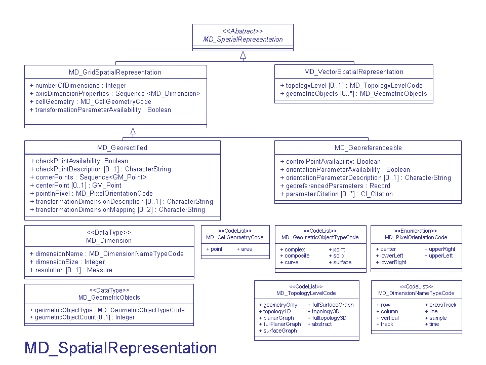

# MD_GeometricObjects

| #   | Elements                                                                          | Usage | Definition and Recommended Practice |
|-----|-----------------------------------------------------------------------------------|-------|-------------------------------------|
| 1   | [geometricObjectType](/iso-explorer/ISO_19115_and_19115-2_CodeList_Dictionaries)  | 1     |                                     |
| 2   | [geometricObjectCount](/iso-explorer/Integer)                                     | 0...1 |                                     |

### **Community Requirements**

*M = Mandatory; C = Conditional; R = Recommended; blank cell = user discretion*

| Community                   | Element              | M C R | Notes |
|-----------------------------|----------------------|-------|-------|
| NOAA Completeness Rubric V2 | geometricObjectType  |       |       |
| NOAA Completeness Rubric V2 | geometricObjectCount |       |       |
|                             |                      |       |       |
| OneStop Project             | geometricObjectType  |       |       |
| OneStop Project             | geometricObjectCount |       |       |

### More Information

### UML

### Links

- [ISO Spatial Representation](/iso-explorer/ISO_Spatial_Representation)
