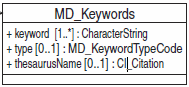

# MD Keywords

| # | Elements                                                          | Usage | Definition and Recommended Practice                                                                                                                                                                                   |
|---|-------------------------------------------------------------------|-------|-----------------------------------------------------------------------------------------------------------------------------------------------------------------------------------------------------------------------|
| 1 | [keyword](/iso-explorer/CharacterString)                          | 1...* | Vocabulary terms that describe the general science categories, general location, organizations, projects, platforms, instruments associated with the resource. Highly recommend using NASA GCMD keywords.             |
| 2 | [type](/iso-explorer/ISO_19115_and_19115-2_CodeList_Dictionaries) | 0...1 | Subject matter used to group similar keywords. Use 'theme' for scientific categories, 'place' for locations, etc. Group keywords by themes and authoritative thesaurus.                                               |
| 3 | [thesaurusName](/iso-explorer/CI_Citation)                        | 0...1 | The citation of the authoritative keyword resource. If the keywords are not supported by an authority, then include a gco:nilReason attribute in the thesaurusName field or write “None” in the citation title field. |

### Community Requirements

*M = Mandatory; C = Conditional; R = Recommended; blank cell = user discretion*

# NOAA Rubric
| Community                   | Element       | M/C/R | Notes                               |
|-----------------------------|---------------|-------|-------------------------------------|
| NOAA Completeness Rubric V2 | keyword       | M     |                                     |
| NOAA Completeness Rubric V2 | type          | M     |                                     |
| NOAA Completeness Rubric V2 | thesaurusName | R     | Extra credit for recommended fields |

# OneStop Project
| Community        | Element       | M/C/R | Notes                                             |
|------------------|---------------|-------|---------------------------------------------------|
| OneStop Project  | keyword       | M     | GCMD Keywords are mandatory for OneStop Readiness |
| OneStop Project  | type          | M     |                                                   |
| OneStop Project  | thesaurusName | M     |                                                   |

### More Information

##### UML

[//]: # (Links)

[//]: # ()
[//]: # ()
[//]: # (<https://geo-ide.noaa.gov/wiki/images/d/df/AB-GUID-01910_R0_KeywordImplementationRecommendations_v1.0.pdf>)

[//]: # ()
[//]: # (-   [Recommended Practice for GCMD Keywords]&#40;/Recommended_Practice_for_GCMD_Keywords "wikilink"&#41;)

[//]: # (-   [Components to common keyword thesauri]&#40;/ISO_Components#CI_Citations_.2F_Keywords "wikilink"&#41;)

[//]: # (-   [Global Change Master Directory Vocabularies]&#40;/Global_Change_Master_Directory_Vocabularies "wikilink"&#41;)

[//]: # (-   [Discovery-level keyword lexicon]&#40;/Discovery-level_keyword_lexicon "wikilink"&#41;)

[//]: # (-   About [ISO Keywords]&#40;/ISO_Keywords "wikilink"&#41;)

