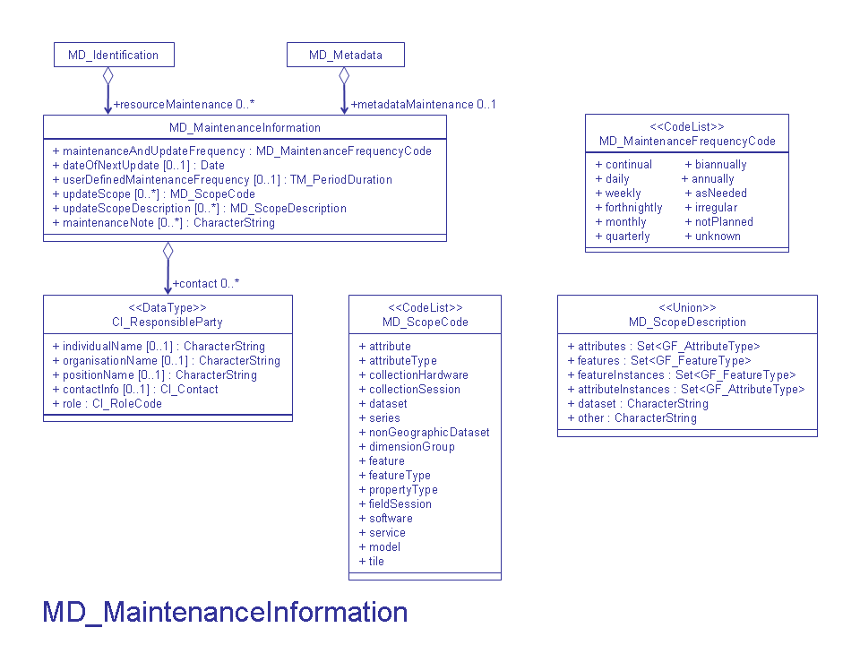

# MD_MaintenanceInformation

It is highly recommended that you use this section to provide citations and identifiers to associated resources, such as papers, user guides, programs and larger works.

| # | Elements                                                                              | Usage | Definition and Recommended Practice                                                                              |
|---|---------------------------------------------------------------------------------------|-------|------------------------------------------------------------------------------------------------------------------|
| 1 | [maintenanceAndUpdateFrequency](/iso-explorer/CharacterString)                        | 1     | Frequency of changes and additions made to the resource or metadata after the initial completion.                |
| 2 | [dateOfNextUpdate](/iso-explorer/Date)                                                | 0...1 | The scheduled revision date for the resource.                                                                    |
| 3 | [userDefinedMaintenanceFrequency](/iso-explorer/TM_PeriodDuration)                    | 0...1 | The maintenance period other than those defined. Recommend providing if the update frequency is less than 1 day. |
| 4 | [updateScope](/iso-explorer/ISO_19115_and_19115-2_CodeList_Dictionaries#MD_ScopeCode) | 0..\* | Scope of resource to which maintenance is applied.                                                               |
| 5 | [updateScopeDescription](/iso-explorer/MD_ScopeDescription)                           | 0..\* | Additional information about the range or extent of the resource.                                                |
| 6 | [maintenanceNote](/iso-explorer/CharacterString )                                     | 0..\* | Information regarding specific requirements for maintaining the resource or recent changes.                      |
| 7 | [contact](/iso-explorer/CI_ResponsibleParty)                                          | 0..\* | Individuals and/or organizations available for maintaining the resource or the metadata.                         |

### Community Requirements

*M = Mandatory; C = Conditional; R = Recommended; blank cell = user discretion*

# NOAA Rubric
| Community                   | Element                         | M/C/R | Notes        |
|-----------------------------|---------------------------------|-------|--------------|
| NOAA Completeness Rubric V2 | maintenanceAndUpdateFrequency   | M     |              |
| NOAA Completeness Rubric V2 | dateOfNextUpdate                |       |              |
| NOAA Completeness Rubric V2 | userDefinedMaintenanceFrequency |       |              |
| NOAA Completeness Rubric V2 | updateScope                     |       |              |
| NOAA Completeness Rubric V2 | updateScopeDescription          |       |              |
| NOAA Completeness Rubric V2 | maintenanceNote                 | R     | Extra credit |
| NOAA Completeness Rubric V2 | contact                         |       |              |

# OneStop Project
| Community       | Element                         | M/C/R | Notes |
|-----------------|---------------------------------|-------|-------|
| OneStop Project | maintenanceAndUpdateFrequency   | M     |       |
| OneStop Project | dateOfNextUpdate                |       |       |
| OneStop Project | userDefinedMaintenanceFrequency |       |       |
| OneStop Project | updateScope                     |       |       |
| OneStop Project | updateScopeDescription          |       |       |
| OneStop Project | maintenanceNote                 |       |       |
| OneStop Project | contact                         |       |       |

### More Information

##### UML

