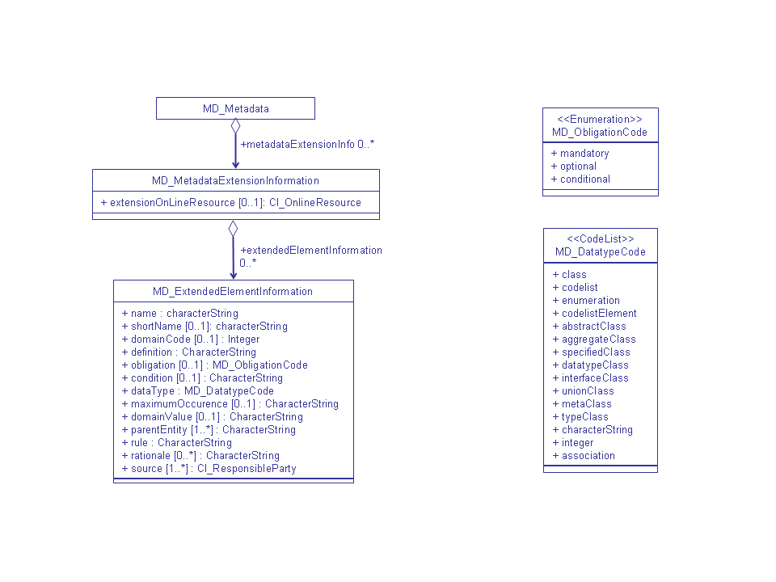

# MD_MetadataExtensionInformation

_Usage: 1 = Mandatory, 0...1 = Optional, 0...* = Optional, can occur more than once_

| #   | Element                                                                   | Usage | Definition and Recommended Practice |
|-----|---------------------------------------------------------------------------|-------|-------------------------------------|
| 1   | [extensionOnLineResource](/iso-explorer/CI_OnlineResource)                | 0...1 |                                     |
| 2   | [extendedElementInformation](/iso-explorer/MD_ExtendedElementInformation) | 0...* |                                     |

### Community Requirements

*M = Mandatory; C = Conditional; R = Recommended; blank cell = user discretion*

| Community                   | Element                    | M C R | Notes                                 |
|-----------------------------|----------------------------|-------|---------------------------------------|
| NOAA Completeness Rubric V2 | extensionOnLineResource    |       | Same requirements as the ISO standard |
| NOAA Completeness Rubric V2 | extendedElementInformation |       | Same requirements as the ISO standard |
|                             |                            |       |                                       |
| OneStop Project             | extensionOnLineResource    |       | Same requirements as the ISO standard |
| OneStop Project             | extendedElementInformation |       | Same requirements as the ISO standard |

### **Community Requirements**

*M = Mandatory; C = Conditional; R = Recommended; blank cell = user discretion*

### More Information

### UML(Unified Modeling Language) Image

[//]: # (Links)

[//]: # (-   [ISO_Extensions]&#40;/ISO_Extensions "wikilink"&#41;)

### XML Example
To add a [Metadata Extension Info](http://www.ngdc.noaa.gov/docucomp/component/00362270-9ce0-11e0-aa82-0800200c9a66) component, add the following MD_MetadataExtensionInformation.

    <gmd:MD_MetadataExtensionInformation>
      <gmd:extensionOnLineResource
        xlink:href="http://www.ngdc.noaa.gov/docucomp/component/00362270-9ce0-11e0-aa82-0800200c9a66"
        xlink:title="Metadata Extension Information"/>
    </gmd:MD_MetadataExtensionInformation>