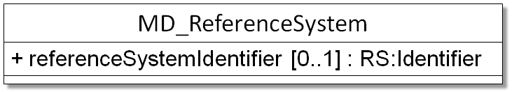

# MD_ReferenceSystem

_Usage: 1 = Mandatory, 0...1 = Optional, 0...* = Optional, can occur more than once_

| #   | Element                                                  | Usage | Definition and Recommended Practice |
|-----|----------------------------------------------------------|-------|-------------------------------------|
| 1   | [referenceSystemIdentifier](/iso-explorer/MD_Identifier) | 0...1 |                                     |

### Community Requirements

*M = Mandatory; C = Conditional; R = Recommended; blank cell = user discretion*

| Community                   | Element                   | M C R | Notes                                 |
|-----------------------------|---------------------------|-------|---------------------------------------|
| NOAA Completeness Rubric V2 | referenceSystemIdentifier |       | Same requirements as the ISO standard |
|                             |                           |       |                                       |
| OneStop Project             | referenceSystemIdentifier |       | Same requirements as the ISO standard |

### More Information

### UML(Unified Modeling Language) Image

[//]: # (Links)

[//]: # ()
[//]: # (-   [Boiler Plate Examples]&#40;/ISO_Boilerplate#Reference_System_Information: "wikilink"&#41;)

[//]: # (-   [View Recommended Components for Reference Systems]&#40;http://www.ngdc.noaa.gov/metadata/published/Examples/iso&#41;)

[//]: # ()
