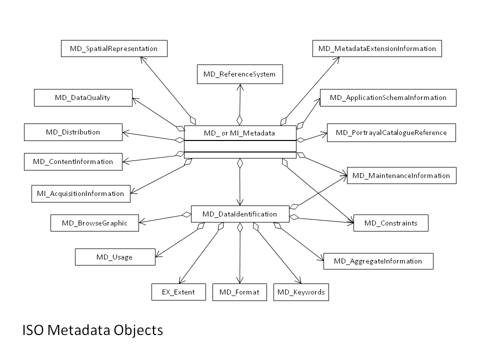

# MI_Metadata

#### Comprehensive explorer of ISO 19115 and 19115-2 metadata standards. These pages show the correct order of the elements, links to child element/object, obligation, repeatability and references to more information and examples.

_Usage: 1 = Mandatory, 0...1 = Optional, 0...* = Optional, can occur more than once_

| #   | Element                                                                                                                                                                           | Usage | Definition and Recommended Practice                                                                                                                                                                                                                                                                                                                                                                                                                                                                                                                                                                                                                                                                                                                                                                                                                     |
|-----|-----------------------------------------------------------------------------------------------------------------------------------------------------------------------------------|-------|---------------------------------------------------------------------------------------------------------------------------------------------------------------------------------------------------------------------------------------------------------------------------------------------------------------------------------------------------------------------------------------------------------------------------------------------------------------------------------------------------------------------------------------------------------------------------------------------------------------------------------------------------------------------------------------------------------------------------------------------------------------------------------------------------------------------------------------------------------|
| 1   | [fileIdentifier](/iso-explorer/CharacterString)                                                                                                                                   | 0...1 | Value that uniquely identifies this metadata record. This identifier is assigned and maintained by the custodian of the metadata record.   Recommended Practice: value of identifier is usually the same as the name of the metadata file - for example C00500. There are two general approaches to ensuring uniqueness for these identifiers:   1. use a universal unique identifier (UUID), to distinguish it from other resources.   2. Include a namespace and a code guaranteed to be unique in that namespace in the identifier. For example: gov.noaa.class:AERO100. In this case gov.noaa.class is a namespace and AERO100 is a code guaranteed to be unique in that namespace. For example: gov.noaa.class:AERO100. In this case gov.noaa.class is a namespace and AERO100 is a code guaranteed to be unique in that namespace. |
| 2   | [language](/iso-explorer/CharacterString)                                                                                                                                         | 0...1 | Language of the metadata record composed of as an ISO639-2/T three letter language code is required and an ISO3166-1 three letter country code is recommended.   **Best Practice `eng; USA`**                                                                                                                                                                                                                                                                                                                                                                                                                                                                                                                                                                                                                                                      |
| 3   | [characterSet](/iso-explorer/ISO19115_and_19115-2_CodeList_Dictionaries)                                                                                      | 0...1 | **Best Practice `utf-8`**                                                                                                                                                                                                                                                                                                                                                                                                                                                                                                                                                                                                                                                                                                                                                                                                                               |
| 4   | [parentIdentifier](/iso-explorer/CharacterString)                                                                                                                                 | 0...1 | Document a higher level metadata record if it exists. Provide full citation to parent in the [MD_AggregateInformation](/iso_explorer/MD_AggregateInformation) section.                                                                                                                                                                                                                                                                                                                                                                                                                                                                                                                                                                                                                                                                                  |
| 5   | [hierarchyLevel](/iso-explorer/ISO19115_and_19115-2_CodeList_Dictionaries)                                                                       | 0...* | Scope of resource to which the metadata applies. Most common values to use are the following: **`dataset`** for granule level, **`series`** for collection level, **`nonGeographicDataset`** for space weather, **`fieldSession`** for cruises or surveys, **`service`** for map services and **`model`**. Repeat if more than one scope is applicable to this metadata description.                                                                                                                                                                                                                                                                                                                                                                                                                                                                    |
| 6   | [hierarchyLevelName](/iso-explorer/CharacterString)                                                                                                                               | 0...* | Character String that represents the name of a for the actual hierarchyLevel which is typically a **`dataset`** or **`series`**.                                                                                                                                                                                                                                                                                                                                                                                                                                                                                                                                                                                                                                                                                                                        |
| 7   | [contact](/iso-explorer/CI_ResponsibleParty)                                                                                                                                      | 1...* | Individual and/or organization responsible for metadata creation and maintenance. Use **`roleCode="pointOfContact"`**. Provide contact details, such address, phone and email.                                                                                                                                                                                                                                                                                                                                                                                                                                                                                                                                                                                                                                                                          |
| 8   | **dateStamp**   (choose one)   [Date](/iso-explorer/Date)   [DateTime](/iso-explorer/DateTime)                                                                     | 1     | Date of last metadata update. Highly recommend revisiting the metadata content annually to ensure that all the information is still relevant.   Use ISO 8601 extended format: **`YYYY-MM-DD`** or **`YYYY-MM-DDTHH:MM:SS`**.                                                                                                                                                                                                                                                                                                                                                                                                                                                                                                                                                                                                                       |
| 9   | [metadataStandardName](/iso-explorer/CharacterString)                                                                                                                             | 1     | Name of the metadata standard used.   **Best Practice `ISO 19115-2 Geographic Information Metadata  Part 2: Extensions for Imagery and Gridded Data`**                                                                                                                                                                                                                                                                                                                                                                                                                                                                                                                                                                                                                                                                                             |
| 10  | [metadataStandardVersion](/iso-explorer/CharacterString)                                                                                                                          | 1     | Version of the metadata standard used.   **Best Practice `ISO 19115-2:2009(E)`**                                                                                                                                                                                                                                                                                                                                                                                                                                                                                                                                                                                                                                                                                                                                                                   |
| 11  | [dataSetURI](/iso-explorer/CharacterString)                                                                                                                                       | 0...1 | **Not recommended for use:** deprecated from ISO 19115-1.                                                                                                                                                                                                                                                                                                                                                                                                                                                                                                                                                                                                                                                                                                                                                                                               |
| 12  | [locale](/iso-explorer/PT_Locale)                                                                                                                                                 | 0...* | Other languages used in metadata. Locale is mandatory when more than one language is used in free text descriptions.                                                                                                                                                                                                                                                                                                                                                                                                                                                                                                                                                                                                                                                                                                                                    |
| 13  | [spatialRepresentationInfo](/iso-explorer/MD_SpatialRepresentation)                                                                                                               | 0...* | Digital representation of spatial information in the dataset.                                                                                                                                                                                                                                                                                                                                                                                                                                                                                                                                                                                                                                                                                                                                                                                           |
| 14  | [referenceSystemInfo](/iso-explorer/MD_ReferenceSystem)                                                                                                                           | 0...* | Identification of the horizontal projections, vertical datums and temporal reference systems used.   Mandatory if spatialRepresentationType is used in dataIdentification common values are **`vector`**, **`grid`**, or **`tin`**.                                                                                                                                                                                                                                                                                                                                                                                                                                                                                                                                                                                                                |
| 15  | [metadataExtensionInfo](/iso-explorer/MD_MetadataExtensionInformation)                                                                                                            | 0...* | Information describing metadata extensions.                                                                                                                                                                                                                                                                                                                                                                                                                                                                                                                                                                                                                                                                                                                                                                                                             |
| 16  | **identificationInfo** (choose one)   [MD_DataIdentification](/iso-explorer/MD_DataIdentification)   [SV_ServiceIdentification](/iso-explorer/SV_ServiceIdentification) | 1...* | Use one and repeat identificationInfo if needed.                                                                                                                                                                                                                                                                                                                                                                                                                                                                                                                                                                                                                                                                                                                                                                                                        |                                                                                                                                                                                                                                                                                                                                                                                                                                                                                                                                                                                                                                                                                        |
| 17  | [contentInfo](/iso-explorer/MD_ContentInformation)                                                                                                                                | 0...* | Information about the feature catalogue, or descriptions of the coverage and the image data characteristics.                                                                                                                                                                                                                                                                                                                                                                                                                                                                                                                                                                                                                                                                                                                                            |
| 18  | [distributionInfo](/iso-explorer/MD_Distribution)                                                                                                                                  | 0...1 | Information about acquiring the resource.                                                                                                                                                                                                                                                                                                                                                                                                                                                                                                                                                                                                                                                                                                                                                                                                               |
| 19  | [dataQualityInfo](/iso-explorer/DQ_DataQuality)                                                                                                                                   | 0...* | The history and quality of the resource.                                                                                                                                                                                                                                                                                                                                                                                                                                                                                                                                                                                                                                                                                                                                                                                                                |
| 20  | [portrayalCatalogueInfo](/iso-explorer/MD_PortrayalCatalogueReference)                                                                                                            | 0...* | A portrayal catalogue is a collection of defined symbols used to depict humans, features on a map.                                                                                                                                                                                                                                                                                                                                                                                                                                                                                                                                                                                                                                                                                                                                                      |
| 21  | [metadataConstraints](/iso-explorer/MD_Constraints)                                                                                                                               | 0...* | The limitations or constraints on the use of or access of the metadata.                                                                                                                                                                                                                                                                                                                                                                                                                                                                                                                                                                                                                                                                                                                                                                                 |
| 22  | [applicationSchemaInfo](/iso-explorer/MD_ApplicationSchemaInformation)                                                                                                            | 0...* | Information about the conceptual schema of the dataset.                                                                                                                                                                                                                                                                                                                                                                                                                                                                                                                                                                                                                                                                                                                                                                                                 |
| 23  | [metadataMaintenance](/iso-explorer/MD_MaintenanceInformation)                                                                                                                    | 0...1 | Document recent metadata record edits. When the metadata is generated automatically, use this section to document the source and transform tool in the maintenanceNote field.   See [MD_MaintenanceInformation Examples](/iso_explorer/MD_MaintenanceInformation)                                                                                                                                                                                                                                                                                                                                                                                                                                                                                                                                                                                  |
| 24  | [acquisitionInformation](/iso-explorer/MI_AcquisitionInformation)                                                                                                                 | 0...* | Information about the platforms and instruments collecting the data.                                                                                                                                                                                                                                                                                                                                                                                                                                                                                                                                                                                                                                                                                                                                                                                    |

## Community Requirements

*M = Mandatory; C = Conditional; R = Recommended; blank cell = user discretion*

# NOAA Rubric
| Community                   | Element                   | M/C/R | Notes                                                                                |
|-----------------------------|---------------------------|-------|--------------------------------------------------------------------------------------|
| NOAA Completeness Rubric V2 | fileidentifier            | M     |                                                                                      |
| NOAA Completeness Rubric V2 | language                  |       | Same requirements as the ISO standard                                                |
| NOAA Completeness Rubric V2 | characterset              |       | Same requirements as the ISO standard                                                |
| NOAA Completeness Rubric V2 | parentIdentifier          |       | Same requirements as the ISO standard                                                |
| NOAA Completeness Rubric V2 | hierarchyLevel            | M     | Same requirements as the ISO standard                                                |
| NOAA Completeness Rubric V2 | hierarchyLevelName        |       | Same requirements as the ISO standard                                                |
| NOAA Completeness Rubric V2 | contact                   | M     | Same requirements as the ISO standard                                                |
| NOAA Completeness Rubric V2 | dateStamp                 | M     | Same requirements as the ISO standard                                                |
| NOAA Completeness Rubric V2 | metadataStandardName      | M     | Same requirements as the ISO standard                                                |
| NOAA Completeness Rubric V2 | metadataStandardVersion   | M     | Same requirements as the ISO standard                                                |
| NOAA Completeness Rubric V2 | dataSetURI                |       | Same requirements as the ISO standard                                                |
| NOAA Completeness Rubric V2 | locale                    |       | Same requirements as the ISO standard                                                |
| NOAA Completeness Rubric V2 | spatialRepresentationInfo |       | Same requirements as the ISO standard                                                |
| NOAA Completeness Rubric V2 | referenceSystemInfo       |       | Same requirements as the ISO standard                                                |
| NOAA Completeness Rubric V2 | metadataExtensionInfo     |       | Same requirements as the ISO standard                                                |
| NOAA Completeness Rubric V2 | identificationInfo        | M     | Same requirements as the ISO standard                                                |
| NOAA Completeness Rubric V2 | contentInfo               | M     | Same requirements as the ISO standard                                                |
| NOAA Completeness Rubric V2 | distributionInfo          | C     | Not required when Resource Hierarchy Level='fieldSession' or Status = 'planned'.     |
| NOAA Completeness Rubric V2 | dataQualityInfo           | M     |                                                                                      |
| NOAA Completeness Rubric V2 | portrayalCatalogueInfo    |       | Same requirements as the ISO standard                                                |
| NOAA Completeness Rubric V2 | metadataConstraints       | M     | Same requirements as the ISO standard                                                |
| NOAA Completeness Rubric V2 | applicationSchemaInfo     | M     | Same requirements as the ISO standard                                                |
| NOAA Completeness Rubric V2 | metadataMaintenance       | R     | Extra credit for recommended fields.                                                 |
| NOAA Completeness Rubric V2 | acquisitionInformation    | C     | Recommended for raw or near-raw observations. Required when lineage is not included. |

# OneStop Project
| Community       | Element                   | M/C/R | Notes                                                                                |
|-----------------|---------------------------|-------|--------------------------------------------------------------------------------------|
| OneStop Project | fileidentifier            | M     |                                                                                      |
| OneStop Project | language                  |       | Same requirements as the ISO standard                                                |
| OneStop Project | characterset              |       | Same requirements as the ISO standard                                                |
| OneStop Project | parentIdentifier          |       | Not allowed, reserved for granule use only.                                          |
| OneStop Project | hierarchyLevel            | M     |                                                                                      |
| OneStop Project | hierarchyLevelName        |       | Same requirements as the ISO standard                                                |
| OneStop Project | contact                   | M     |                                                                                      |
| OneStop Project | dateStamp                 | M     |                                                                                      |
| OneStop Project | metadataStandardName      | M     |                                                                                      |
| OneStop Project | metadataStandardVersion   | M     |                                                                                      |
| OneStop Project | dataSetURI                |       | Same requirements as the ISO standard                                                |
| OneStop Project | locale                    |       | Same requirements as the ISO standard                                                |
| OneStop Project | spatialRepresentationInfo |       | Same requirements as the ISO standard                                                |
| OneStop Project | referenceSystemInfo       |       | Same requirements as the ISO standard                                                |
| OneStop Project | metadataExtensionInfo     |       | Same requirements as the ISO standard                                                |
| OneStop Project | identificationInfo        | M     |                                                                                      |
| OneStop Project | contentInfo               | M     |                                                                                      |
| OneStop Project | distributionInfo          | C     | Not required when Resource Hierarchy Level='fieldSession' or Status = 'planned'.     |
| OneStop Project | dataQualityInfo           | M     |                                                                                      |
| OneStop Project | portrayalCatalogueInfo    |       | Same requirements as the ISO standard                                                |
| OneStop Project | metadataConstraints       | M     | Same requirements as the ISO standard                                                |
| OneStop Project | applicationSchemaInfo     | M     | Same requirements as the ISO standard                                                |
| OneStop Project | metadataMaintenance       | R     | Extra credit for recommended fields.                                                 |
| OneStop Project | acquisitionInformation    | C     | Recommended for raw or near-raw observations. Required when lineage is not included. |

### More Information

#### UML(Unified Modeling Language) Image

